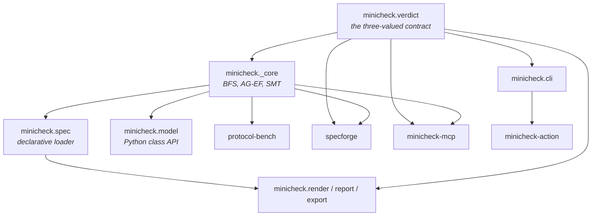

# Architecture notes

How the pieces are put together, and why. Useful before contributing, or before deciding whether to
trust any of it.

## The dependency graph

`verdict` sits at the root deliberately. It has no dependencies of its own, and everything that
produces or renders a verdict goes through it — so the meaning of `UNDETERMINED` cannot drift
between the CLI, the MCP server, the Action and the emitters.

`polyfrac` and `failclosed` are independent; they share the discipline, not the code.

## The engine

Breadth-first reachability over an explicit state set. A state is a tuple of field values; the
frontier is a `deque`; visited states are a dict mapping state → (predecessor, label) so a trace can
be reconstructed by walking backwards.

BFS rather than DFS for one reason: **the first violating state found is at minimum depth**, so
counterexamples are shortest by construction rather than by a later minimisation pass.

Invariants are evaluated **inline during the sweep**, not in a second pass. That was a change from
the original design and it is what lets a counterexample survive a truncated search — the witness is
recorded when the state is first reached, before any later step runs out of room.

Measured: 3.2×10⁵–1.0×10⁶ states/second for declarative specs, ~342 bytes per state.

## Why declarative specs exist alongside the Python API

Two audiences with incompatible needs.

The `Protocol` and `Model` APIs take Python callables — maximally expressive, and completely
unsuitable for anything you did not write. A spec arriving over a network or from a language model
must not be executable.

The JSON format is deliberately weak: field names, literals, equality tests, `incr`/`decr`. It
cannot express arbitrary computation, which is exactly the property that makes it safe to accept
from a stranger. `Model.to_spec()` **refuses** rather than approximating, because a Python guard can
express conditions the JSON cannot and emitting an approximation would produce a spec for a
different machine.

## The compiled transition path

Declarative specs are compiled once at build time into index-addressed tuples — guards as
`(position, value)` pairs, assignments as `(position, value)`, increments as `(position, name,
delta)`. The hot loop does no name lookups and no `isinstance` checks on constants.

Measured **4.6× mean** over the interpreted version (n=5 runs; per-run means 4.46–4.85×, median
4.62×; Apple M-series, CPython 3.11, load average 8.15/9.56/10.57 at measurement). Reproduce with
`python bench.py` in the `minicheck` repo, which re-implements the pre-optimisation transition
function so the comparison runs from one checkout with no old release needed.

The speedup depends strongly on model size, and the spread is the honest part:

| model | states | interpreted | compiled | speedup |
|---|---|---|---|---|
| `counters_2x40` | 1681 | 38.2 ms | 5.7 ms | **6.7×** |
| `counters_3x12` | 2197 | 24.5 ms | 5.0 ms | 4.9× |
| `counters_4x7` | 4096 | 37.8 ms | 8.9 ms | 4.3× |
| `ring_9` | 9 | 0.0 ms | 0.0 ms | 2.8× |

!!! note "This page previously said 2.8×"
    That was the **minimum** across the four models, not the mean — and it came from `ring_9`, a
    9-state model whose timings round to 0.0 ms and which is therefore noise-dominated. The figure
    was understated by roughly 65%. On the models anyone actually waits for — the thousand-state
    ones — the measured speedup is closer to **6.7×**. Corrected 2026-07-31 after re-running the
    committed benchmark five times; the number went up, and the range is published alongside the
    mean so a single flattering row cannot stand in for the result.

The correctness argument is a differential test requiring the compiled and interpreted paths to
agree on **every successor of every reachable state**, including on when to raise
`IntBoundExceeded` — an optimisation that changed a verdict would be far worse than a slow one.

The one runtime check that remains is the bound on `incr`/`decr`, because that genuinely depends on
the current value.

## Testing philosophy

Three kinds of test, in increasing order of how much they are trusted:

1. **Unit tests** — the least valuable. They ask whether the code agrees with itself.
2. **Adversarial tests** — malformed, empty, enormous, out-of-distribution input, with one oracle:
   *no input may produce a confident-looking answer that is wrong.*
3. **Differential tests** — the most valuable. The engine against a naive reimplementation sharing
   no code; the export against SPIN; a compiled path against an interpreted one.

The root cause of every defect found in the original audit was that the suite only ever asked "does
the checker agree with itself". It never asked "does it agree with the truth". The differential
tests are that question.

Regression suites are also **mutation-tested**: reintroduce the bug, confirm the suite goes red. A
suite that passes on both the broken and the fixed code is worth nothing, and this has caught a test
that was passing for the wrong reason.

## Documentation is tested

Every numeric claim in a README is re-derived by `tests/test_readme_claims.py` in that repo: badge
counts against `pytest --collect-only`, line counts against the source tree, and tutorial outputs
against a real run.

This exists because documentation drift is the quiet member of the same family — a claim that was
true once, is false now, and looks equally authoritative either way.
