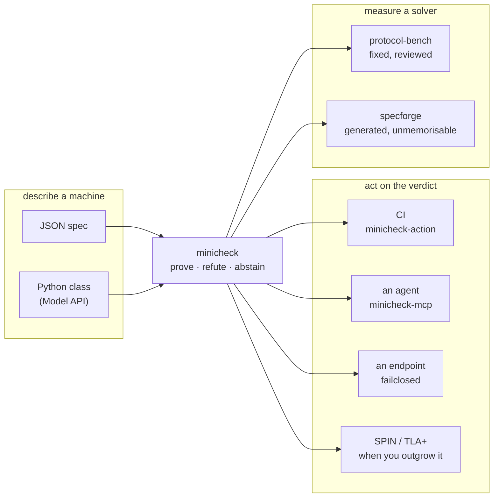

# A verdict you cannot check is not a verdict

Six tools built around one idea. They are small, they refuse to guess, and every claim they make can
be checked by someone who does not trust them.

---

## The problem they share

A verification tool that says "safe" is asking you to stop looking. That is the entire value it
offers — and it means the tool's only real failure mode is not being *slow* or *limited*, but being
**confidently wrong**.

The usual way this happens is not a dramatic bug. It is a search that quietly ran out of room and
reported success anyway; a claim that was recorded without the evidence it needed; an error path
that returned something a caller reads as a pass. Each of these produces an answer that looks
exactly like a correct one.

Every tool here is built to make that specific failure impossible, and each takes a different bite
out of it:

| | |
|---|---|
| [**minicheck**](tools/minicheck.md) | Prove or refute a state machine's invariants — and say *undetermined* when neither was established |
| [**specforge**](tools/specforge.md) | Generate benchmark tasks whose answers are computed, so a score cannot be inflated by memorisation |
| [**protocol-bench**](tools/protocol-bench.md) | A fixed benchmark where a claimed detection must **replay** before it counts |
| [**minicheck-mcp**](tools/minicheck-mcp.md) | Give an agent a decision procedure, so it checks rather than guesses |
| [**minicheck-action**](tools/minicheck-action.md) | Carry the verdict into CI without letting "I could not tell" become green |
| [**failclosed**](tools/failclosed.md) | Refuse any HTTP response that was not affirmatively proven safe |
| [**polyfrac**](tools/polyfrac.md) | Exact arithmetic that refuses inexact input rather than silently approximating |

---

## The one idea, stated once

**Refuting and proving need different amounts of evidence.**

To show a property is *broken*, you need one counterexample. That witness stands on its own — it
does not matter whether the search that found it finished, because the trace replays and anyone can
check it.

To show a property *holds*, you are making a claim about every reachable state. That needs the whole
space. A search that stopped early has established nothing.

So there are three answers, not two:

```
PROVED         the whole reachable space was enumerated, and the property held everywhere
REFUTED        a counterexample exists; it is attached, and it replays
UNDETERMINED   the analysis did not finish, so nothing was established
```

**`UNDETERMINED` is never a pass.** It exits `3` in the CLI, fails the job in CI, maps to `<error>`
in JUnit and `informational` in SARIF, and is `null` — never `true` — in every API. That single
commitment is what the rest of this is built on top of, and it is defined in exactly one place:
[`minicheck.verdict`](concepts/verdicts.md).

[Read the concepts guide →](concepts/verdicts.md){ .md-button .md-button--primary }
[Start the tutorial →](guides/tutorial.md){ .md-button }

---

## Sixty seconds

```console
$ pip install "minicheck @ git+https://github.com/nickharris808/minicheck.git"
$ minicheck example > spec.json
$ minicheck check spec.json
REFUTED

  states explored   6
  exhaustive        yes

  [REFUTED]      not_both — violated in 2 steps
        0  (initial)        a=0, b=0, lock=0
        1  a_enter          a=1, b=0, lock=1
        2  b_enter          a=1, b=1, lock=1
$ echo $?
2
```

Two processes both entered the critical section. Not "this might race" — the exact interleaving,
in the order it happens.

Add the missing `lock` guard to both `when` clauses and it proves, in three states, exit `0`.

---

## How they fit together



`minicheck` is the engine. Everything else either **feeds** it a model, **carries** its verdict
somewhere useful, or **measures** how well something else does the same job.

---

## What none of this does

Being clear about the limits is the point, not a disclaimer.

- **It checks your model, not your system.** A model abstracts, and an abstraction can hide a real
  defect. A `PROVED` verdict is a statement about the machine you wrote down.
- **It is bounded.** Explicit-state search in CPython runs out of room somewhere around 10⁵–10⁶
  states. Past that you get `UNDETERMINED`, and the honest move is to
  [export to SPIN or TLC](https://github.com/nickharris808/minicheck#export-to-spin-and-tla).
- **It does not read specifications.** Turning prose into a model is the hard part and it is still
  yours.
- **It makes no claim about any named third-party protocol or product** beyond the small,
  human-reviewed corpus in `protocol-bench`.

If a tool here ever gives you a confident answer it has not earned, that is a bug of the most
serious kind — please [open an issue](https://github.com/nickharris808/minicheck/issues).

---

## Where to go next

- **New here?** [The tutorial](guides/tutorial.md) takes a retry loop from broken to proved.
- **Deciding whether to use this?** [How it compares](guides/comparison.md) to TLA+, SPIN and Alloy,
  including where it loses.
- **Sceptical?** [The FAQ](guides/faq.md) answers the objections directly.
- **Want the theory?** [What "proved" means](concepts/what-it-proves.md).
